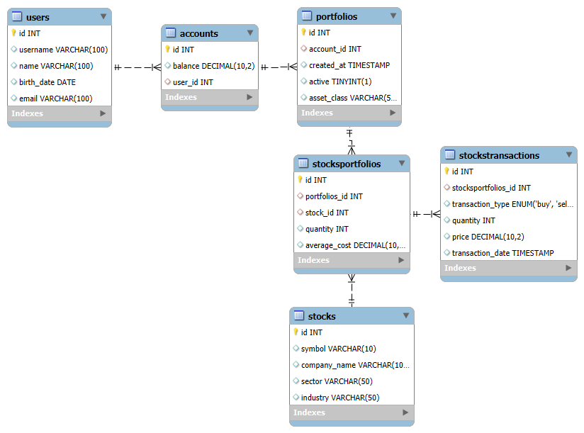
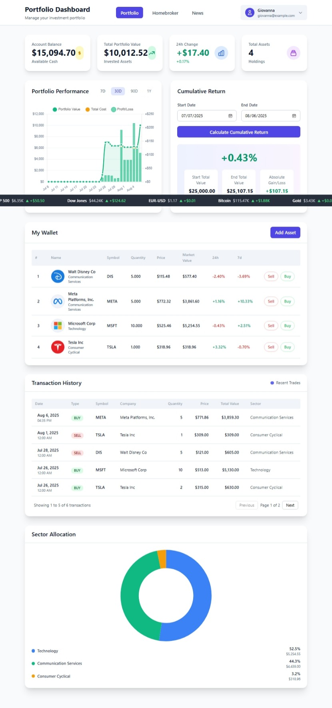
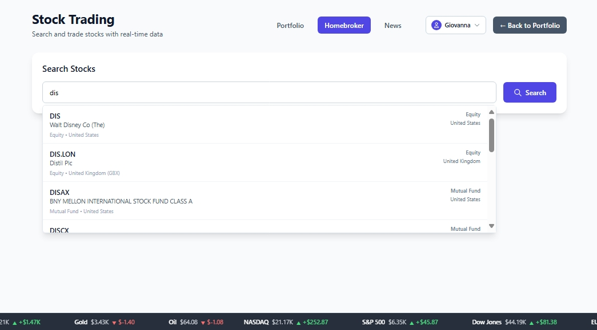
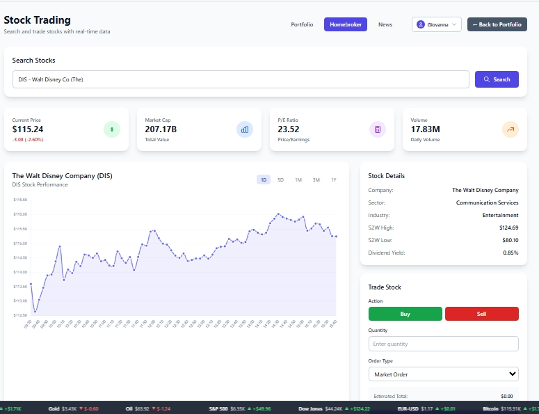
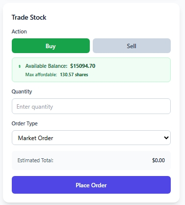
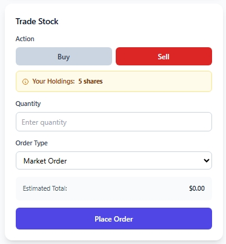

# TAP-CS-Portfolio-Manager

# Set Up 

## Setting up the Database
To set up our database, we used MySQL Workbench. We created a new schema called 'bygdb' and by running the SQL script located at `/data/createDatabase.sql`. This creates all necessary tables.

To populate them with initial data, run the SQL script located at `/data/updateDatabase.sql`. This will insert sample data into the tables. This file can be modified to create new users. Users, accounts and portfolios ids are created via sql scripts - creation is not yet supported by the frontend.

## Running server
```bash
cd server
python -m venv .venv
.venv\Scripts\activate
pip install -r requirements.txt
pip install yfinance --upgrade --no-cache-dir
python app.py
```

## Running client
After running the server, open ``localhost:5000`` in your browser.

## Dumping the database to a file
Run this command on bash:
```bash
& "C:\Program Files\MySQL\MySQL Server 8.0\bin\mysqldump.exe" -u root -p bygDB > latest_dump.sql

```

# Our Database Structure


## Relationships
* users 1 -- 1 accounts: Each user has exactly one account.

* accounts 1 -- * portfolios: Each account can have multiple portfolios.

* portfolios 1 -- * stocksportfolios: Each portfolio can contain multiple stocks (represented by entries in stocksportfolios).

* stocks 1 -- * stocksportfolios: Each stock can be in multiple portfolios.

* stocksportfolios 1 -- * stockstransactions: Each entry in stocksportfolios can have multiple buy/sell transactions associated with it.

## Assumptions
* Users are unique.
* Only one account per user is allowed.
* Each account can have multiple portfolios.
* Each portfolio contains a single equity asset class.
* A user can only have one portfolio for a given asset class.
* Only Equity portfolios are supported in this version of the project.
* The stocksportfolios is an intermediate table that links portfolios to stocks through foreign keys.
* Each portfolio can hold multiple stocks.
* The row in stocksportfolio is never deleted when a stock is removed from a portfolio; instead, the corresponding entry in stocksportfolios is marked as inactive.

* Each stock can appear in multiple portfolios.

* Each transaction is linked to a specific stock within a portfolio.
 
* Transactions include details such as date, quantity, price, and type (buy or sell).


* The application supports both **buy** and **sell** transactions for stocks.
* The application does not support short-selling or margin trading.
* The application supports only **long positions**.
* All stocks are bought and sold at current market prices.
* A stock average cost is calculated as a weight average of the prices paid for each share purchased.
* No dividends are paid out.
* There is no commission fee when buying or selling stocks.
* Buy Transactions are only executed if there are sufficient funds available in the account.
* Sell Transactions are only executed if there are sufficient shares of the stock in the portfolio.
* The application calculates the average cost of a stock based on its purchase history.
* The application displays the daily change in portfolio value compared to the previous day.


# The Application 


## The Portfolio 



This page provides a comprehensive view of a user's **equity portfolio**.  
It lists all stocks currently held, their performance, transaction history, and sector allocation.  
The dashboard is designed to help users track **portfolio value**, **daily changes**, and **cumulative returns** over time.

---

The Portfolio Dashboard is divided into several sections:

#### **1. Header Tiles (Summary Cards)**

- **Account Balance**  
  - Displays the **available cash** in the user's account.  
  - This balance is included in profit calculations but **cannot be transferred from or to other accounts**.

- **Total Portfolio Value**  
  - Shows the **total market value of all invested assets** for the current day.  
  - **Formula:**  
    ```text
    Total Portfolio Value = Σ(Market Value of each Stock)
    ```  
  - Market value is updated using **Yahoo Finance historical data** via `ticker.history()`.

- **24h Change**  
  - Displays the **profit/loss** considering the **change in total portfolio value** since yesterday.

---

## Home Broker

### 🔍 Stock Search



The **search functionality** enables users to find stocks and funds by ticker symbol or company name.

- The search uses the [Alpha Vantage API](https://www.alphavantage.co/documentation/#symbolsearch) `SYMBOL_SEARCH` endpoint to retrieve matching securities in real time.
- Results display:
  - Ticker symbol
  - Company or fund name
  - Instrument type (Equity or Mutual Fund)
  - Country of listing

Example: Searching for `dis` shows options like:
- `DIS` — Walt Disney Co (Equity, United States)
- `DIS.LON` — Distil Plc (Equity, UK)
- `DISAX` — BNY Mellon International Stock Fund (Mutual Fund, US)

### 🛒 Trading Stocks



After selecting a stock, the page shows detailed information:

#### **Header Metrics**
- **Current Price**
  - Live price of the security
  - Includes change and % movement for the day
- **Market Cap**
  - Total market capitalization
- **P/E Ratio**
  - Price-to-earnings ratio
- **Volume**
  - Daily trading volume

#### **Performance Chart**
- Interactive price chart with selectable timeframes:
  - 1D (1 day)
  - 5D (5 days)
  - 1M (1 month)
  - 3M (3 months)
  - 1Y (1 year)

#### **Stock Details Panel**
- Company name and sector
- Industry classification
- 52-week high and low
- Dividend yield

Example for Disney (DIS):
- Sector: Communication Services
- Industry: Entertainment
- 52W High: $124.69
- 52W Low: $80.10
- Dividend Yield: 0.85%

---


At the bottom right, the **Trade Stock** panel allows placing buy or sell orders.

#### **Buy Mode**



- When **Buy** is selected:
  - You can enter the quantity to purchase
  - Choose the order type (e.g., Market Order)
  - Estimated total updates based on current price × quantity
  - **Place Order** button finalizes the trade
  -If you don't have sufficient funds, an error message appears


#### **Sell Mode**



- When **Sell** is selected:
  - The panel shows:
    - **Your Holdings** — e.g., “5 shares” currently owned
  - Quantity input to specify how many shares to sell
  - Order type selector
  - Estimated proceeds display dynamically
  - **Place Order** button executes the sell order
  -If you don't have enough shares, an error message appears


---

## News 


---

## 📊 Market Indices Banner  

| Market Type          | Index / Pair         | Number of Constituents | Weighting Method        | Sector / Asset Focus            | Volatility    |
| -------------------- | -------------------- | ---------------------- | ----------------------- | ------------------------------- | ------------- |
| 📈 **US Stock Market**  | **NASDAQ Composite** | 3,000+                 | Market-cap weighted     | Tech-heavy (growth & biotech)   | High          |
| 📈 **US Stock Market**  | **S\&P 500**         | 500                    | Market-cap (free-float) | Broad multi-sector (11 sectors) | Moderate      |
| 📈 **US Stock Market**  | **Dow Jones (DJIA)** | 30                     | Price-weighted          | Blue-chip, industrial focus     | Low–Moderate  |
| 💱**Foreign Exchange** | **EUR/USD**          | 2 (Euro vs US Dollar)  | Not applicable          | Major currency pair (forex)     | Moderate–High |
| 🪙 **Crypto**            | **BTC/USD**          | 1 (Bitcoin)            | Not applicable          | Cryptocurrency (decentralized)  | Very High     |
| 🥇** Commodities Market** | ** Gold (XAU / USD)** | 1 (Gold)               | Not applicable          | Precious metal & inflation hedge   |  Moderate     |
| 🛢** Commodities Market** | ** Crude Oil (WTI)**  | 1 (Oil)                | Not applicable          | Energy commodity & macro indicator |  High          |

---

## 🌐 API Endpoints

### 🔐 User & Accounts
- `GET /users` – Get all users
- `GET /balance?user_id=` – Get balance for a user
- `GET /wallet?user_id=` – Get current wallet (holdings + prices)

### 📈 Portfolio & Trading
- `GET /portfoliovalue?user_id=` – Get total market value
- `POST /trade` – Execute trade (`buy`/`sell` with JSON body)
- `GET /transactions?user_id=` – Get all stock transactions

### 📉 Historical Charts
- `GET /historical-data?user_id=` – Portfolio value over time
- `GET /historical-cost?user_id=` – Invested cost over time
- `GET /historical-balance?user_id=` – Cash balance over time

### 📊 Market Data
- `GET /search?query=` – Search stocks via Alpha Vantage
- `GET /stock/<symbol>` – Get detailed stock info
- `GET /stock/<symbol>/history?frontend_period=1M` – Historical prices for a stock (supports periods like `1D`, `5D`, `1M`, `3M`, `1Y`)
- `GET /marketsindices` – Get stock indices, currencies, and commodities

### 🧠 Recommendations & News
- `GET /recommendationsandsentiment?user_id=` – Portfolio-wide analyst recommendations, price targets, sentiment
- `GET /news` – Get financial news with images

## 👥 Team Members
- **[Baibhav Barwal](https://github.com/baiibhav)**
- **[Giovana Gennari Jungklaus](https://github.com/gigennari)**
- **[Yixuan Wang](https://github.com/YixuanWang1122)**

